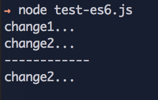

### 写个了 20 来行的 ES6 简版

### API

- sub: 订阅
- emit: 触发

> sub 会返回删除当前注册事件的方法，可以调用直接删除当前注册的事件。

### 惯例简单测试 = .=

> 测试代码：test-es6.js

这次 events 的作用域外部不能访问

### 之前复杂一点的版本
### API

- on: 注册
- once: 注册一次
- emit: 触发事件
- off: 取消注册
- destory: 销毁指定类型所有注册

### 简单测试 = .=
> 测试代码：test.js （没有用什么测试库，保持简单）

